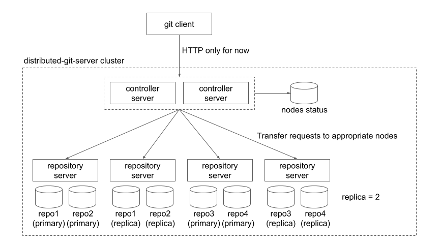

distributed-git-server
========

## What's this?

This is an experimental project to make a distributed git server cluster. The main goal of this project is to find a reasonable way to add scalability and redundancy to git repositories. Basic idea is locating git repositories on multiple nodes, and proxy requests from git clients to appropriate nodes. This approach is similar to [GitHub's DGit](https://githubengineering.com/introducing-dgit/).

The distributed gitserver cluster consists of following two kinds of servers:

- [Controller server](https://github.com/takezoe/distributed-git-server/tree/master/dgit-controller-server)

  This is a front server of the cluster. It manages repository servers and proxy requests from git clients to appropriate repository servers. We can make redundant it by setup multiple instances with a load balancer. 

- [Repository server](https://github.com/takezoe/distributed-git-server/tree/master/dgit-repository-server)

  This is a storage server of the cluster. Git repositories are located on this kind of servers actually. We can add any number of repository server instances to the cluster.



This project is still under development phase, but if you are interested, please try it. Any feedback is welcome!

## Setup

You can run distributed-git-server only from source code for now. This guide shows how to run the cluster with minimum configuration (one controller server and one repository server on a single machine).

### Prerequisites

- Java 8
- sbt
- MySQL

You have to create an empty database before run the controller server.

### Controller server

Modify `dgit-controller-server/src/main/resources/application.conf` for your environment, and run as following:

```
$ cd dgit-controller-server
$ sbt ~jetty:start
```

The controller server is started on port 8080 in default. Tables are created automatically in the database configured in `application.conf`.

### Repository server

Modify `dgit-repository-server/src/main/resources/application.conf` for your environment, and run as following:

```
$ cd dgit-repository-server
$ sbt ~jetty:start
```

The repository server is started on port 8081 in default.

### Check the cluster operation

Let's create a new repository and push a commit using `git` command to check the cluster operation.

You can create a new repository as following:

```
$ curl -XPOST http://localhost:8080/api/repos/test
```

In this case, a repository url is `http://localhost:8080/git/test.git`.

Create a local repository:

```
$ mkdir test
$ cd test
$ git init
```

Push a first commit to the remote repository on the cluster:

```
$ touch README.md
$ git add .
$ git commit -m 'first commit'
$ git remote add origin http://localhost:8080/git/test.git
$ git push origin master
```

The remote repository is created under the directory configured in the repository server's `application.conf`.
